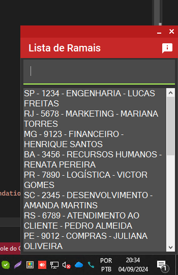
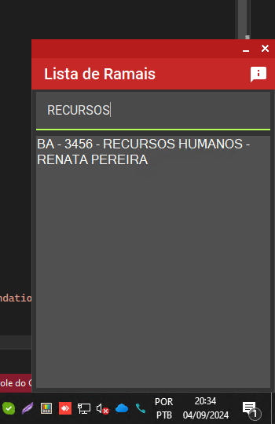
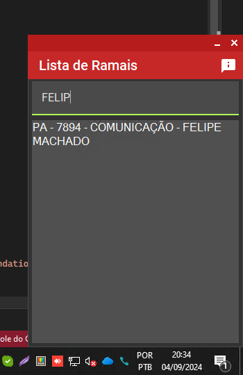

# Lista de Ramais

**Lista de Ramais** é um aplicativo para gerenciamento e busca de ramais de telefone, com suporte para conexão com bancos de dados SQLite, OracleDB e MySQL. Sendo usado em produção por duas empresas até o último Release deste projeto. Atentando a funcionalidade simples de estar presente na **Bandeja do Sistema** e poder ser evocado quando o usuário necessitar de uma rápida consulta aos ramais, podendo buscar por nome do funcionário, departamento, UF e ramal.

## Capturas de Tela

Aplicativo com a tela inicial exibindo todos os registros permitindo ao usuário buscar com a barra de rolagem:

Aplicativo com o usuário filtrando por departamento e nome:

